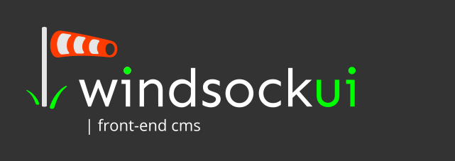

* This project is pre-alpha, in active development (do help us get to alpha)
* There isn't as yet a plug-and-play release (do help us make one)
* This is a proof of principle at the moment. The acutal libraries will be moved to `front-end cms`

## | windsockui Introduction
`windsockui` is a dynamic content framework for vue.js that hydrates pages with content, for editable components. This allows developers to make their pages (and components) "editable" without needing their customers to login to an admin system. The goal is to allow front-end developers to claim back valuable territory from Wordpress. Developers create bespoke web sites with drop-in CMS functionality and a wide array of drop-in editable tailwind components. 

## | front-end cms
The `|front-end cms` aspect of `windsockui` features a main component that facilitates the adding and removing and reordering / rearranging of components (drag and drop) by a user, in the front-end, when they are authenticated. It also contains a set of utility components that allow "non-editable" components to become editable, by wrapping them in a data component, of which a user can edit the source data.  

Other aspects of the system are the `|datastore` and the `|vue.js tailwind components`. Libraries will be extracted from this project and moved from `|example` to `|front-end cms`

In this example, we're going to build the https://windsockui.com (not up yet) web site.  

## Setup
Work in progress. Watch this space.

## Usage
Work in progress. Watch this space.

## Issues
None 

